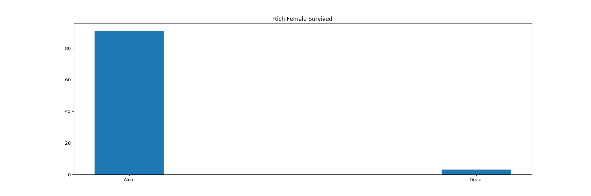
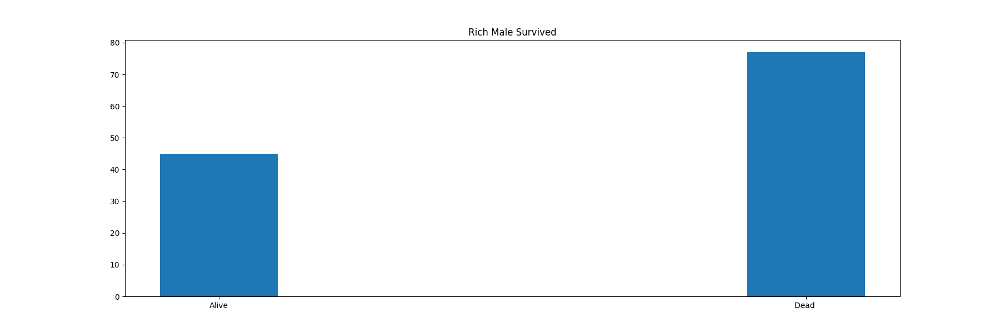
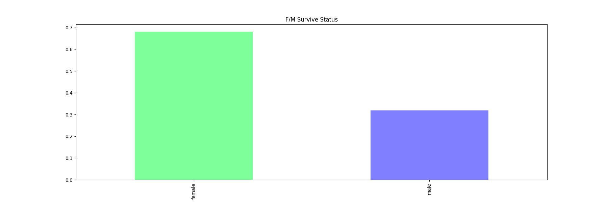

# Titanic Machine Learning from Disaster  
Solution of the Titanic Machine Learning from Disaster competition 
  
### Motivation  
Kaggle is an amazing platform to improve data science skills. Titanic Machine Learning from Disaster was my first competition and I learned a lot of thing about random forest algorithm, decision trees and preprocessing
  
### Prerequisites  
```  
Pandas
```  
```  
Sklearn  
```  
```  
Matplotlib  
```  
```  
Numpy  
```  
```  
Dataset: https://www.kaggle.com/c/titanic  
```  
  
## Dataset  
Titanic Data Set includes 10 attribute.  
**Survived:**
Passenger survival status. 0 dead 1 alive<br/>
**Pclass:**
Class of the passenger, best metric to understand passenger economic situation<br/>
**Name:**
Name of the passenger, trivial data<br/>
**Sex:**
Sex of the passenger, very important metric<br/>
**Age:**
Age of the passenger<br/>
**SibSp:**
Siblings / spouses aboard the Titanic<br/>
**Parch:**
Parents / children aboard the Titanic<br/>
**Ticket:**
Ticket numver of the passenger<br/>
**Fare:**
Passenger fare<br/>
**Cabin:**
Cabin number<br/>
**Embarked:**
Port of Embarkation<br/>

I discarded name, ticket, cabin and embarked columns.

- Name is trivial for my model
- Cabin number data is insufficient and unorganised 
- Embarked and survival status correlation is to low
- Ticket data in unorganised




  
  
  
## Model  
I used the random forest algorithm. Random forest is a classification algorithm consisting of many decision trees. To "Titanic Machine Learning from Disaster" competition one of the best choices is a random forest algorithm. Sklearn RandomForestClassifier gets two hyperparameters as n_estimators and random_state. The best fit for random_state is 2. To find n_estimators I tried values between 2 to 30. The best fit is 20.

	n_estimators: 2
	Accuracy: 0.8516746411483254
	n_estimators: 3
	Accuracy: 0.8516746411483254
	n_estimators: 4
	Accuracy: 0.8827751196172249
	n_estimators: 5
	Accuracy: 0.8851674641148325
	n_estimators: 6
	Accuracy: 0.8732057416267942
	n_estimators: 7
	Accuracy: 0.868421052631579
	n_estimators: 8
	Accuracy: 0.861244019138756
	n_estimators: 9
	Accuracy: 0.8708133971291866
	n_estimators: 10
	Accuracy: 0.8708133971291866
	n_estimators: 11
	Accuracy: 0.8755980861244019
	n_estimators: 12
	Accuracy: 0.8755980861244019
	n_estimators: 13
	Accuracy: 0.8875598086124402
	n_estimators: 14
	Accuracy: 0.8899521531100478
	n_estimators: 15
	Accuracy: 0.8851674641148325
	n_estimators: 16
	Accuracy: 0.8851674641148325
	n_estimators: 17
	Accuracy: 0.8851674641148325
	n_estimators: 18
	Accuracy: 0.8851674641148325
	n_estimators: 19
	Accuracy: 0.8947368421052632
	n_estimators: 20
	Accuracy: 0.8947368421052632
	n_estimators: 21
	Accuracy: 0.8947368421052632
	n_estimators: 22
	Accuracy: 0.8875598086124402
	n_estimators: 23
	Accuracy: 0.8851674641148325
	n_estimators: 24
	Accuracy: 0.8947368421052632
	n_estimators: 25
	Accuracy: 0.8899521531100478
	n_estimators: 26
	Accuracy: 0.8803827751196173
	n_estimators: 27
	Accuracy: 0.8875598086124402
	n_estimators: 28
	Accuracy: 0.8779904306220095
	n_estimators: 29
	Accuracy: 0.8755980861244019


## Score  
Score of the algorithm is
 **0.8947368421052632**  🎉🎉
  
  
## Authors  
  
* **Fatih Canbekli** - *Initial work*  
  
## License  
  
Copyright (c) 2013 Fatih Canbekli

Permission is hereby granted, free of charge, to any person obtaining a copy of this software and associated documentation files (the "Software"), to deal in the Software without restriction, including without limitation the rights to use, copy, modify, merge, publish, distribute, sublicense, and/or sell copies of the Software, and to permit persons to whom the Software is furnished to do so, subject to the following conditions:

The above copyright notice and this permission notice shall be included in all copies or substantial portions of the Software.

THE SOFTWARE IS PROVIDED "AS IS", WITHOUT WARRANTY OF ANY KIND, EXPRESS OR IMPLIED, INCLUDING BUT NOT LIMITED TO THE WARRANTIES OF MERCHANTABILITY, FITNESS FOR A PARTICULAR PURPOSE AND NONINFRINGEMENT. IN NO EVENT SHALL THE AUTHORS OR COPYRIGHT HOLDERS BE LIABLE FOR ANY CLAIM, DAMAGES OR OTHER LIABILITY, WHETHER IN AN ACTION OF CONTRACT, TORT OR OTHERWISE, ARISING FROM, OUT OF OR IN CONNECTION WITH THE SOFTWARE OR THE USE OR OTHER DEALINGS IN THE SOFTWARE.